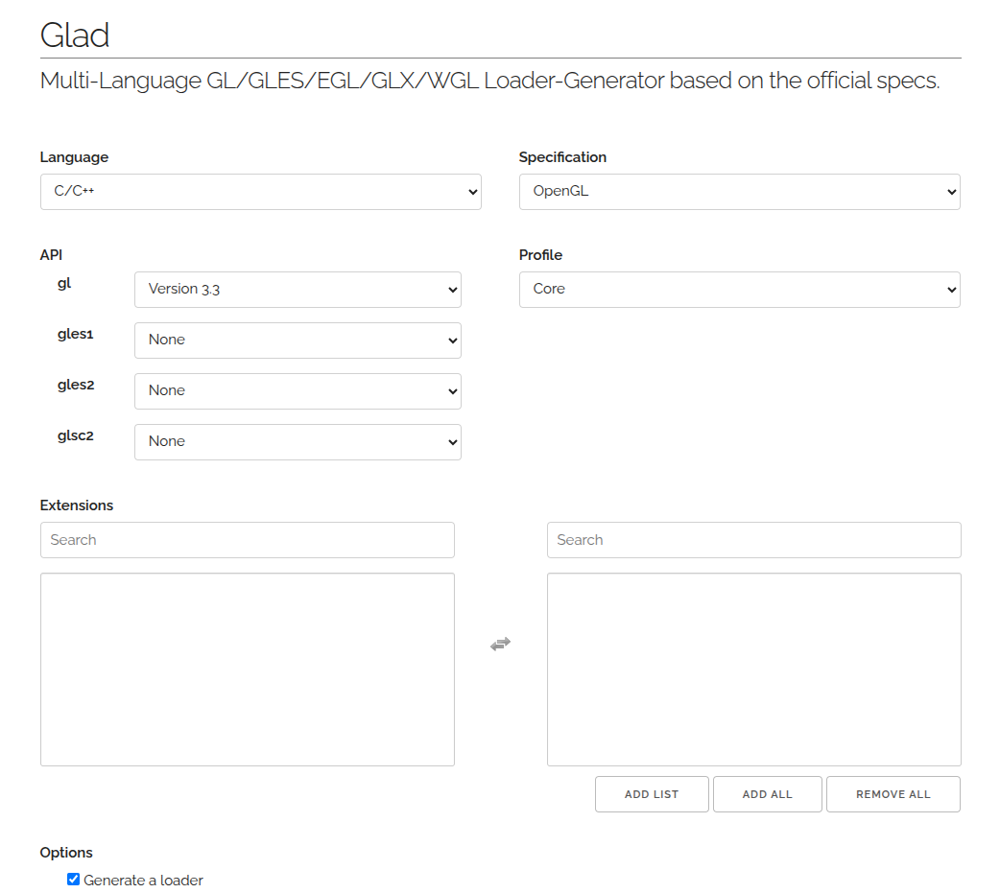

## Install Dependencies:
1. Install OpenGL:
    ```bash
    sudo apt install mesa-common-dev libgl1-mesa-dev libglu1-mesa-dev mesa-utils
    ```
2. Install GLFW and GLM:
    ```bash
    sudo apt install libglfw3-dev libglm-dev
    ```

## Setup GLAD
1. Visit [Glad Tool](https://glad.dav1d.de/) to get OpenGL bindings for c++.

2. Place `glad.c` in src.
3. Place the `glad` folder in the `include` directory.
___
The project should look like this by now:

    fluid_sim
    ├── bin
    ├── build
    ├── CMakeLists.txt
    ├── image.png
    ├── include
    │   ├── fluid_sim.h
    │   └── glad
    │       └── glad.h
    ├── README.md
    └── src
        ├── fluid_sim.cpp
        ├── glad.c
        └── main.cpp

## Build
From the root of the workspace, run the build script with:
    ```bash
    ./build.sh
    ```
